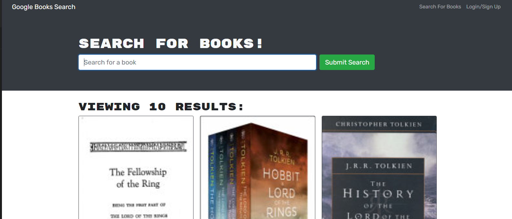

# **ZE Book Search**

## **Purpose**

A book searching web app where a user can type a search term in a search box and the results appear showing an image, title, author. The user can save books by clicking "Save This Book!" under each search result and view their saved books on a separate page by choosing that option.

## **Table of Contents**

<a href="#installation">Installation</a>

  <!-- <a href="#usage">Usage</a>  -->

<a href="#userLicense">License</a>

<a href="#contributions">Contributions</a>

  <!-- <a href="#tests">Tests</a>  -->

<a href="#questions">Questions</a>

## <h2 id="installation">**Installation**</h2>

The app is deployed and live on Heroku.

https://ze-book-search.herokuapp.com/

  <!-- ## <h2 id="usage">**Usage**</h2>
  sf -->

## <h2 id="userLicense">**License**</h2>

### <em>NOTICE</em>:

This application is covered under the
Unlicense license.  
 More info can be found here:
https://unlicense.org/

## <h2 id="contributions">**Contributions**</h2>

Visit GitHub and fork the repo. If you'd like to make changes, submit a pull request for review.

  <!-- ## <h2 id="tests">**Tests**</h2>
  na  -->

## <h2 id="questions">**Questions**</h2>

For additional information please contact me via email:

zaceitel@gmail.com

or visit my github page:

https://github.com/Zeitel42
